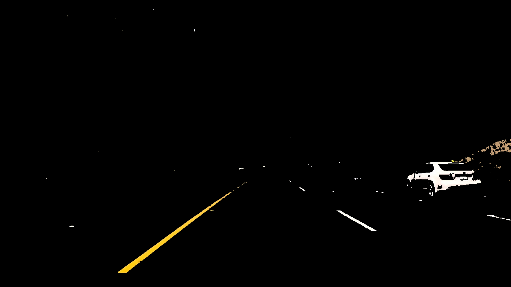
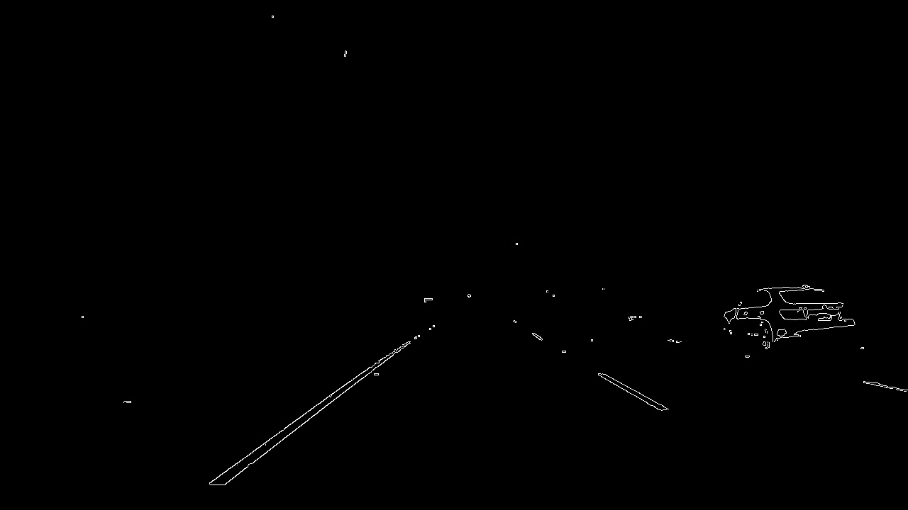
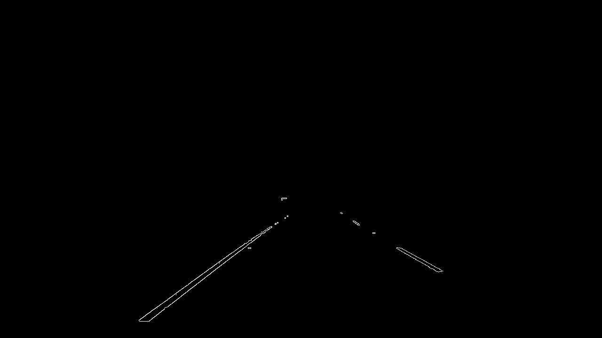
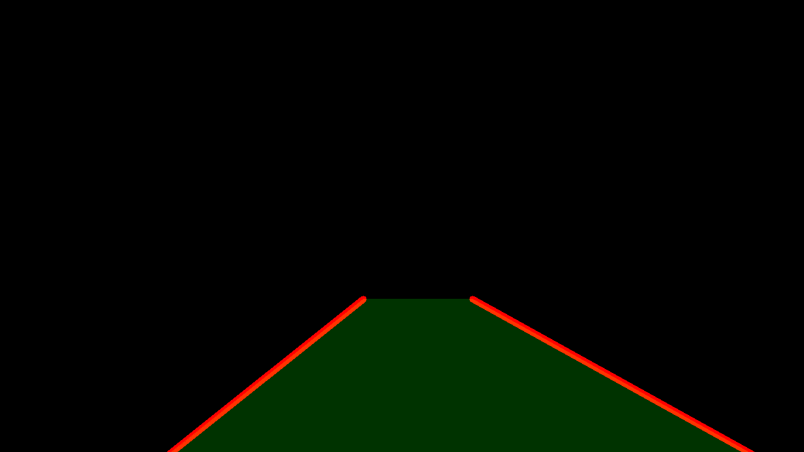
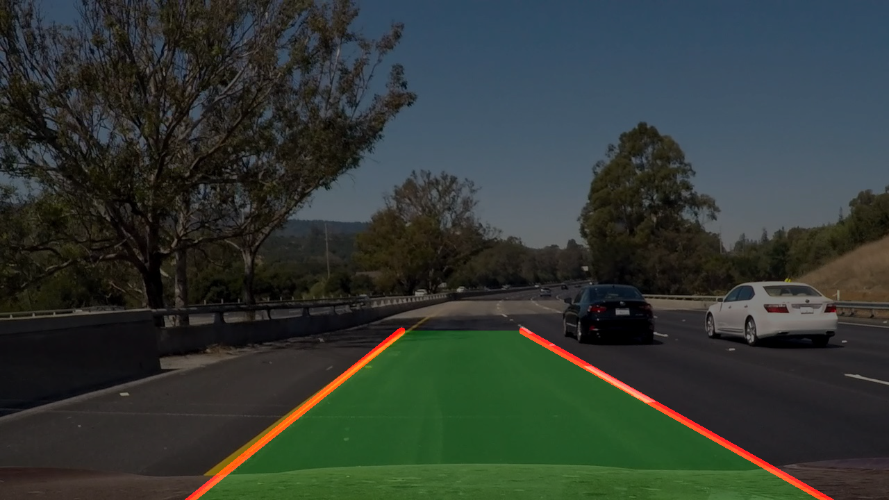

#Finding Lane Lines on the Road

## Description
Driving lane lines detection using OpenCV. Following techniques are used:

- Canny Edge Detection
- Color Selection
- Region of Interest Selection
- Gaussian blur

#### Files
- [`writeup.md`](http://github.com/kkweon/lane-detection/writeup.md): this file
- [`P1.ipynb`](http://github.com/kkweon/lane-detection/P1.ipynb): Jupyter Notebook file
- `*.mp4` or `*.jpg`: used data

##1. Description of pipelines
My pipeline consisted of 6 steps. 

1. Extract only yellow and white portions from the image by using `cv2.inRange` because I assume all lane markers are yellow or white.
After the color selection, my image looks like this:  

2. Gaussian-blur the image using filter size 5. It helps smoothing out some edges and removes some noises  

3. Extract edges using the [Canny algorithm](http://docs.opencv.org/2.4/modules/imgproc/doc/feature_detection.html?highlight=canny#canny86).  

4. Crop and focus only the region of interest.  Assuming the camera is attached to the fixed position, I can remove outside of my ROI.  

5. Most of the visible parts are now line segments with some noises. **I also want to draw two long lines not multiple line segments**. In order to achieve that, I created a new function called
`draw_avg_lines(img, lines, color=[255, 0, 0], thickness=2, info=dict())`
    - Created a dictionary called `info`
        - It holds information about the latest 100 line segments
        - Even if no lane is detected, it detects the lanes using the previous information
    - Divide the `lines` input (from Hough Line Transform) into **two sub-lists** by computing the slope of each line segments
        - *if the slope is negative, it must be part of the left line of the image*
            - why? because the image is in perspective. The smaller object it is, the further it is
            - why? because y-axis is inverted in OpenCV 
                - (0,0) coordinate is upper left corner
                - (MAX\_WIDTH, MAX\_HEIGHT) is bottom right corner
    - I compute **median slopes** for left and right lines
        - I used **median** because there are some *outliers(false detection)*
    - Now if I know the slope and points. I can draw lines as below
    - I actually filled up the region in green to make it more visible

6. Combine the detected line image and the original image  

##2. Potential shortcomings
1. It assumes the lane marker colors are yellow and white. But for some reason if its lane markers are not yellow nor white, it won't able to recognize the lane
2. It's drawing two straight lines. Therefore, it seems a bit off-lane when there is a curve

##3. Possible improvements

1. By drawing a curve (instead of a line), it can detect lane more smoothly
2. Instead of using median and running average, there should be a better way to detect lanes in a noiseless way by optimizing hyperparameters 